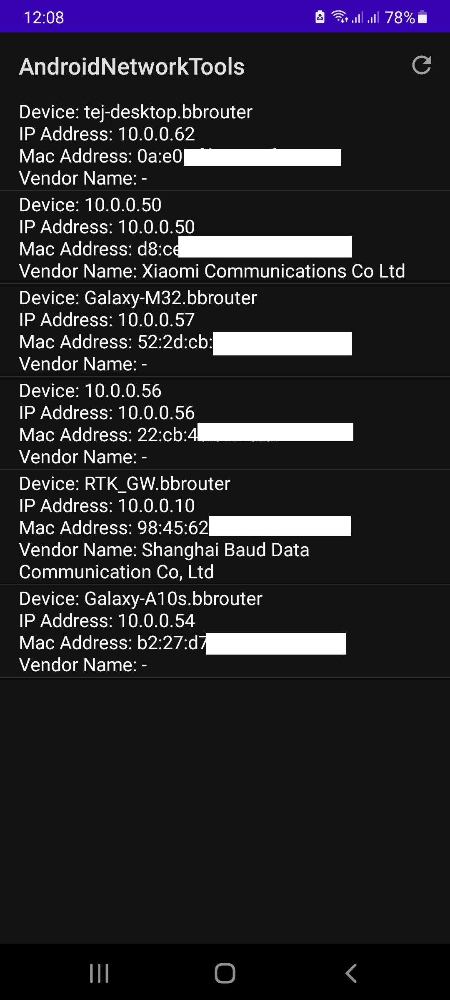

# Android Network Tools

<p align="center">
    
</p>

## Update settings.gradle(Project Settings)

```gradle
dependencyResolutionManagement {
    repositoriesMode.set(RepositoriesMode.FAIL_ON_PROJECT_REPOS)
    repositories {
        google()
        mavenCentral()

        maven { url 'https://jitpack.io' }
    }
}
```

## Update build.gradle(Module: project.app)

```gradle
implementation 'com.github.tejmagar:AndroidNetworkTools:1.0.2alpha'
```

## Sample code

```java
NetworkScanner.init(this);

NetworkScanner.scan(new OnNetworkScanListener() {
    @Override
    public void onComplete(List<Device> devices) {
        for (Device device : devices) {
            Log.d("device", device.hostname + "\n" + device.vendorName + "\n" + device.macAddress);
        }
    }

    @Override
    public void onFailed() {

    }
);
```

## Optional

<p>After Network scanner is initialized, you can disable MAC Address and Vendor names processing
as shown below.
Note: MAC Address is required to lookup vendor name.</p>

```java
NetworkScanner.setShowMacAddress(false);
NetworkScanner.setShowVendorInfo(false);
```

## Traceroute

```java
 Traceroute.init(this);
 Traceroute.start("google.com", new OnTracerouteListener() {
    @Override
    public void onRouteAdd(Route route) {
        Log.d(TAG, "traceroute: IP Address =>" + route.ipAddress + "=>"
               + "RAW: " + route.rawAddress);
    }

    @Override
    public void onComplete(List<Route> routes) {
        Log.d(TAG, "traceroute: " + "completed total: " + routes.size());
    }

    @Override
    public void onFailed() {
        Log.d(TAG, "traceroute failed");
    }
 });
```

## Use Target SDK 29 or below for MAC Address

<p>See: https://developer.android.com/about/versions/11/privacy/mac-address
